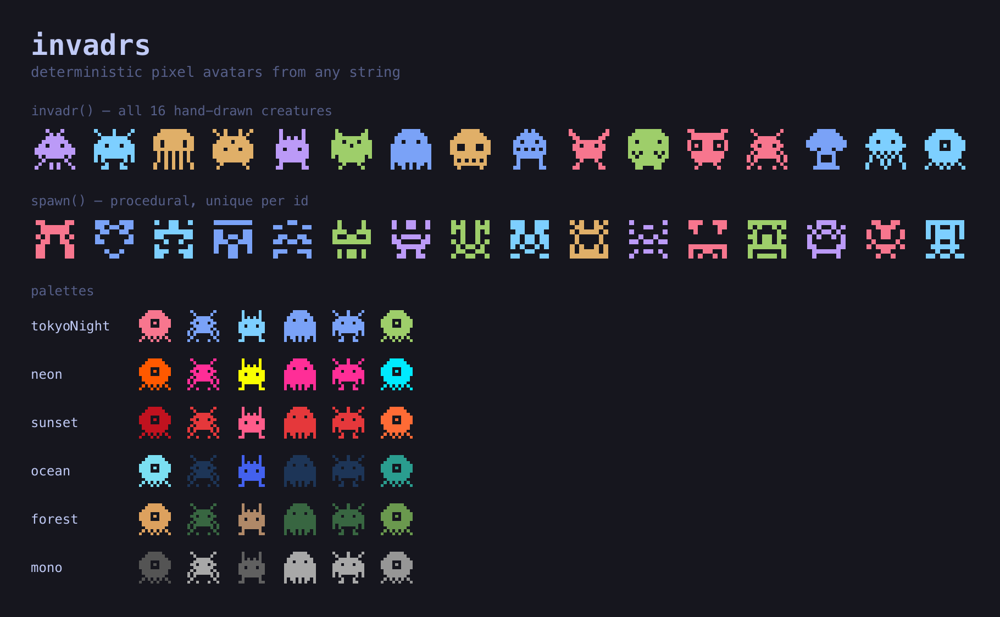

# invadrs

Deterministic space-invaders-style pixel avatars from any string. Zero
dependencies. Same id in, same avatar out, forever.

**[🕹 Live demo & Storybook →](https://invadrs.pages.dev)**



```ts
import { invadr, spawn, dataUri } from "invadrs";

invadr("matt");                       // hand-drawn creature, SVG string
spawn("matt");                        // procedural creature, SVG string
invadr("matt", { palette: "sunset", size: 32 });
dataUri(invadr("matt"));              // data:image/svg+xml,...
```

## Primitives

- `invadr(id, options?)` — one of 16 hand-drawn creatures.
- `spawn(id, options?)` — a unique procedural symmetric creature.

## Options

`{ size?, palette?, padding?, background?, title?, resolution? }`
(`resolution` is `spawn`-only; when `size` is omitted no `width`/`height` is set,
so host CSS controls the size.)

## Palettes & theming

Built-ins, each its own colour mood: `tokyoNight` (default, balanced rainbow),
`neon` (electric, dark-bg), `sunset` (warm), `ocean` (cool), `forest`
(greens/earth), `mono` (grayscale). Pass a name, your own `string[]`, a full
`{ colors, background }` object, or `"css-vars"` to emit `var(--accent)`… fills
that follow your theme.

```ts
import { palettes } from "invadrs";
const brand = { colors: [...palettes.tokyoNight.colors, "#ff00aa"] };
invadr("matt", { palette: brand });
```

## React

```tsx
import { Invadr, Spawn, InvadrsProvider } from "invadrs/react";

<Invadr id="matt" palette="css-vars" />   {/* hand-drawn creature */}
<Spawn id="matt" />                         {/* procedural creature */}

{/* app-wide defaults; explicit props on a component win */}
<InvadrsProvider palette="tokyoNight" size={20}>…</InvadrsProvider>
```

## Stability contract

The hash, the order of the built-in creatures, the procedural generator, and the
`css-vars` color order are **frozen**. Changing any of them alters existing
avatars and is only ever done in a major release.
