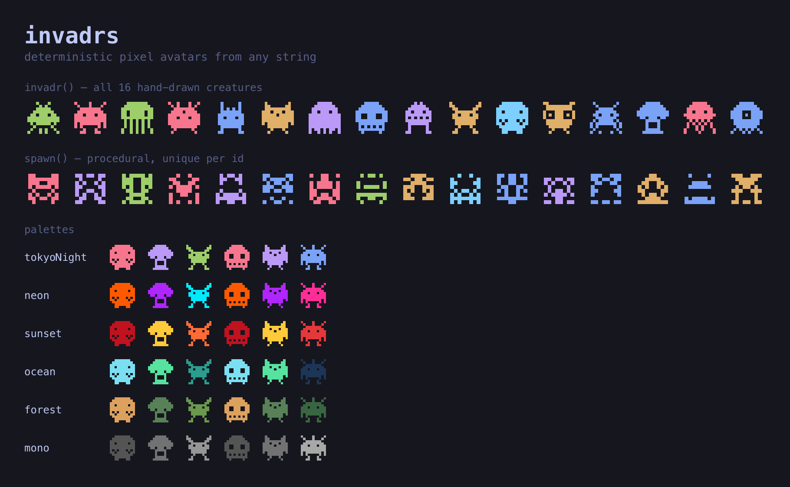

# invadrs

Deterministic space-invaders-style pixel avatars from any string. Zero
dependencies. Same id in, same avatar out, forever.

**[🕹 Live demo & Storybook →](https://invadrs.pages.dev)**



```ts
import { invadr, spawn, dataUri } from "invadrs";

invadr("matt");                       // hand-drawn creature, SVG string
spawn("matt");                        // procedural creature, SVG string
invadr("matt", { palette: "sunset", size: 32 });
dataUri(invadr("matt"));              // data:image/svg+xml,...
```

## Primitives

- `invadr(id, options?)` — one of 16 hand-drawn creatures.
- `spawn(id, options?)` — a unique procedural symmetric creature.

## Options

`{ size?, palette?, padding?, background?, title?, resolution?, sprite?, color?, salt?, accent?, tint? }`
(`resolution` is `spawn`-only and `sprite` is `invadr`-only; when `size` is
omitted no `width`/`height` is set, so host CSS controls the size.)

`color` picks a palette index for the body. `salt` shifts every avatar
(empty means none). `accent` fills the eyes and mouth with a second
color. `tint` adds a faint background in a palette color (a `background`
wins).

## A distinct avatar per person

Two ids can land on the same creature and color. For a known set of people
(a team, a chat room), `distinctAvatars` hands each id its own pair:

```ts
import { distinctAvatars, invadr } from "invadrs";

const avatars = distinctAvatars(["ana", "ben", "cy"], { palette: "neon" });
invadr("ben", { palette: "neon", ...avatars.get("ben") });
```

Pass the same `palette` and `salt` you render with. Each id keeps its own
pair unless an earlier id holds it, so appending a person never changes
anyone before them. A 6-color palette gives 96 distinct pairs; past that,
pairs repeat.

## Palettes & theming

Built-ins, each its own colour mood: `tokyoNight` (default, balanced rainbow),
`neon` (electric, dark-bg), `sunset` (warm), `ocean` (cool), `forest`
(greens/earth), `mono` (grayscale). Pass a name, your own `string[]`, a full
`{ colors, background }` object, or `"css-vars"` to emit `var(--accent)`… fills
that follow your theme.

```ts
import { palettes } from "invadrs";
const brand = { colors: [...palettes.tokyoNight.colors, "#ff00aa"] };
invadr("matt", { palette: brand });
```

## React

```tsx
import { Invadr, Spawn, InvadrsProvider } from "invadrs/react";

<Invadr id="matt" palette="css-vars" />   {/* hand-drawn creature */}
<Spawn id="matt" />                         {/* procedural creature */}

{/* app-wide defaults; explicit props on a component win */}
<InvadrsProvider palette="tokyoNight" size={20}>…</InvadrsProvider>
```

## Stability contract

These are **frozen**:

- the hash (FNV-1a finished with murmur3's fmix32)
- the salt format (`salt + "\u0000" + id`; an empty salt means none)
- the seed bit ranges (creature `% 16`, color `>>> 4`, accent `>>> 12`,
  tint `>>> 20`)
- the accent rule (picked among the colors other than the body color;
  drawn in enclosed holes, found by a 4-way flood fill from the grid edge)
- the tint opacity (0.18)
- the built-in creatures (their art and order)
- the built-in palette colors and their order
- the procedural generator
- the `css-vars` color order
- the `distinctAvatars` assignment order

Changing any of them alters existing avatars and is only ever done in a
major release.

## Upgrading from 0.x

1.0 changes the hash, so every avatar changes. Replace `distinctSprites`
by spreading the whole pick: `const avatars = distinctAvatars(ids)`, then
`invadr(id, { ...avatars.get(id) })`. Pass the same palette and salt you
render with. The pick's `.sprite` alone is not equivalent, because only
the (creature, color) pair is distinct. Pin `0.3.x` to keep the old
avatars.
